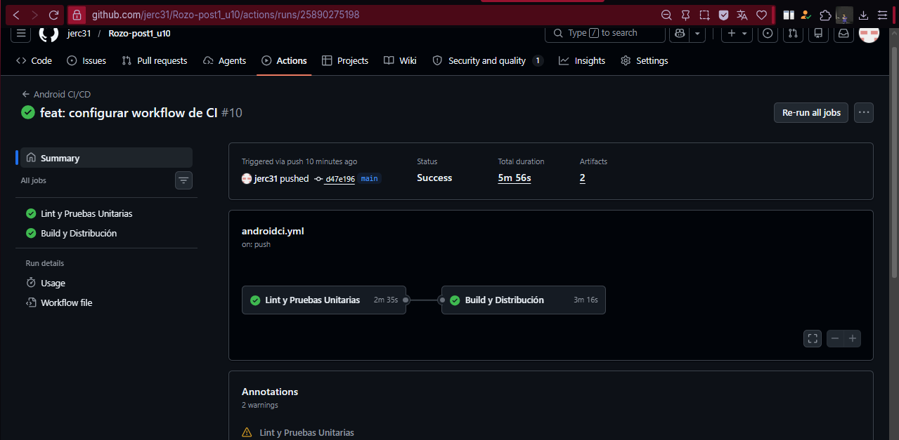
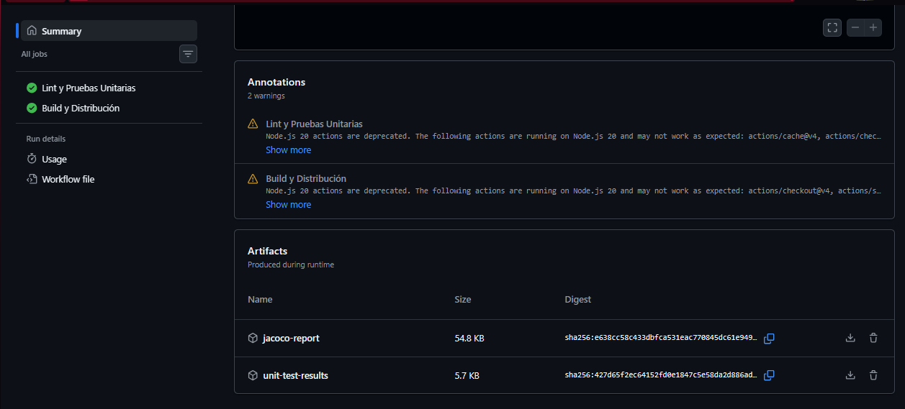
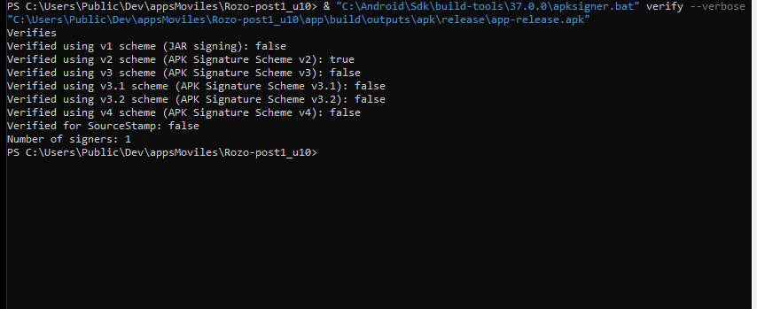
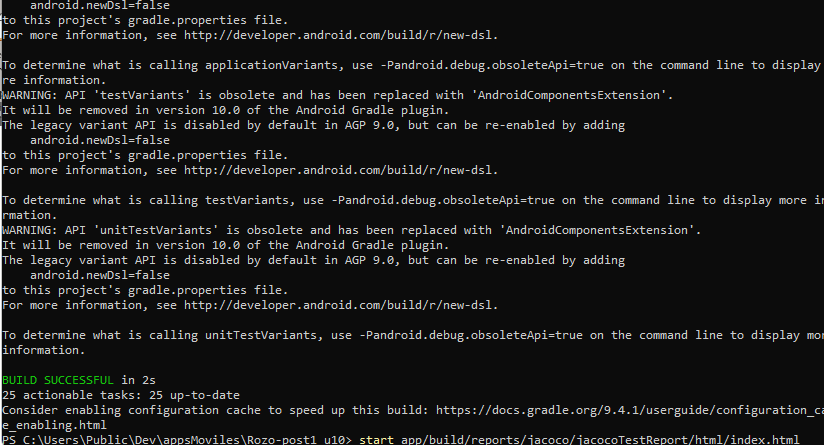

# Pipeline CI/CD para Android con GitHub Actions

## Información del Estudiante

**Nombre:** Ángel Rizo Arias  
**Código:** 02230132004  
**Programa:** Ingeniería de Sistemas  
**Unidad:** Unidad 10 – Integración, Entrega y Operación (CI/CD)  
**Actividad:** Post-Contenido 1  
**Fecha:** 14/05/2026

---

# Estado del Pipeline


Repositorio del workflow:  
https://github.com/02230132004-miguel/Rizo_Arias-post1-u10/actions/workflows/androidci.yml

---

# Descripción del Proyecto

Este proyecto consiste en la implementación de un flujo de integración y entrega continua (CI/CD) para una aplicación Android, utilizando GitHub Actions como herramienta principal de automatización.

El objetivo es automatizar todo el ciclo de construcción y validación del software, desde el análisis del código hasta la generación y publicación del APK.

El pipeline contempla:

- Revisión del código con Lint  
- Ejecución de pruebas unitarias automatizadas  
- Generación del APK en modo release  
- Firma digital del APK mediante Keystore  
- Publicación automática en Firebase App Distribution  
- Medición de cobertura de pruebas con JaCoCo  
- Validación de calidad mínima del código  

---

# Objetivo del Proyecto

El propósito de este trabajo es desarrollar un pipeline CI/CD que permita:

- Automatizar procesos de validación del código  
- Garantizar builds confiables y repetibles  
- Gestionar credenciales de forma segura con GitHub Secrets  
- Generar y firmar aplicaciones Android automáticamente  
- Distribuir versiones en Firebase sin intervención manual  
- Controlar la calidad del software mediante cobertura de pruebas  

---

# Tecnologías Utilizadas

- Kotlin  
- Android Studio  
- Gradle  
- GitHub Actions  
- Firebase App Distribution  
- JaCoCo  
- YAML  
- PowerShell / Bash  

---

# Estructura del Proyecto

```text
.github/
└── workflows/
    └── androidci.yml

app/
├── src/
├── build.gradle.kts
└── release-key.jks

gradle/
README.md
```

---

# Configuración de Firebase App Distribution

Se integró Firebase App Distribution para automatizar la entrega de versiones de la aplicación a testers.

## Configuración del plugin

### build.gradle.kts (nivel raíz)

```kotlin
plugins {
    id("com.google.firebase.appdistribution") version "5.2.1" apply false
}
```

### build.gradle.kts (módulo app)

```kotlin
plugins {
    id("com.google.firebase.appdistribution")
}
```

---

# Configuración de Firma (Keystore)

El APK se firma automáticamente dentro del pipeline utilizando variables de entorno que contienen la información del keystore.

```kotlin
signingConfigs {
    create("release") {
        storeFile = file(System.getenv("KEYSTORE_PATH") ?: "release-key.jks")
        storePassword = System.getenv("KEYSTORE_PASS") ?: ""
        keyAlias = System.getenv("KEY_ALIAS") ?: ""
        keyPassword = System.getenv("KEY_PASS") ?: ""
    }
}
```

---

# Gestión de Secrets en GitHub

Las credenciales sensibles se almacenan en GitHub Secrets para evitar su exposición en el repositorio:

| Variable | Descripción |
|----------|-------------|
| KEYSTORE_BASE64 | Keystore en formato Base64 |
| KEYSTORE_PASS | Contraseña del almacén de claves |
| KEY_ALIAS | Alias de la clave |
| KEY_PASS | Contraseña del alias |
| FIREBASE_APP_ID | ID de la aplicación en Firebase |
| FIREBASE_TOKEN | Token de autenticación Firebase CLI |

---

# Arquitectura del Pipeline

El flujo de CI/CD se divide en dos etapas principales:

## 1. Etapa de validación

Encargada de asegurar la calidad del código antes de generar el build:

- Análisis estático con Lint  
- Ejecución de pruebas unitarias  
- Generación de reporte de cobertura  
- Aplicación de Quality Gate  

## 2. Etapa de construcción y despliegue

Responsable de generar y distribuir la aplicación:

- Compilación del APK en release  
- Firma del APK  
- Publicación en Firebase App Distribution  

---

# Flujo General del Pipeline

```text
Inicio (Push / Pull Request)
        ↓
Validación del código fuente
        ↓
Ejecución de pruebas automatizadas
        ↓
Generación de cobertura (JaCoCo)
        ↓
Validación Quality Gate
        ↓
Construcción del APK Release
        ↓
Firma digital del APK
        ↓
Publicación en Firebase App Distribution
```

---

# Workflow en GitHub Actions

Ubicación del archivo:

```text
.github/workflows/androidci.yml
```

El pipeline ejecuta automáticamente:

- Clonación del repositorio  
- Configuración de Java 17  
- Caché de dependencias Gradle  
- Lint del proyecto  
- Pruebas unitarias  
- Generación de cobertura  
- Construcción del APK  
- Distribución en Firebase  

---

# Configuración de JaCoCo

Se utiliza JaCoCo para medir la cobertura de pruebas:

```kotlin
jacoco {
    toolVersion = "0.8.11"
}

tasks.withType<Test> {
    finalizedBy(tasks.named("jacocoTestReport"))
}
```

---

# Quality Gate de Cobertura

El pipeline establece un mínimo del 60% de cobertura en líneas de código.

Si este porcentaje no se cumple, el proceso de despliegue se detiene automáticamente.

---

# Verificación del APK Firmado

Para validar la firma del APK se usa:

```powershell
apksigner verify --verbose app/build/outputs/apk/release/app-release.apk
```

Resultado esperado:

```text
Verified using v2 scheme (APK Signature Scheme v2): true
```

---

# Prueba Unitaria de Ejemplo

```kotlin
@Test
fun validarSuma() {
    assertEquals(4, calculator.sumar(2, 2))
}
```

---

## Capturas del Proyecto

Las siguientes evidencias se encuentran en la carpeta `/evidencias/`:

## Job Lint y build and distribution exitosos en Actions



## Artefactos del repositorio accesibles



## Firebase App Distribution exitosa


## Verificación firmado del apk



## Reportes de Jacoco



## Reporte de cobertura


---

# Conclusiones

Con este laboratorio se logró implementar un flujo CI/CD completo para Android utilizando GitHub Actions y Firebase App Distribution.

Además del proceso automatizado de build y distribución, se integró un sistema de validación de calidad mediante JaCoCo y un Quality Gate de cobertura mínima, permitiendo detectar automáticamente builds con pruebas insuficientes antes de distribuir nuevas versiones.

El proyecto también aplica buenas prácticas de seguridad utilizando GitHub Secrets para proteger credenciales sensibles relacionadas con el Keystore y Firebase.

```

```
